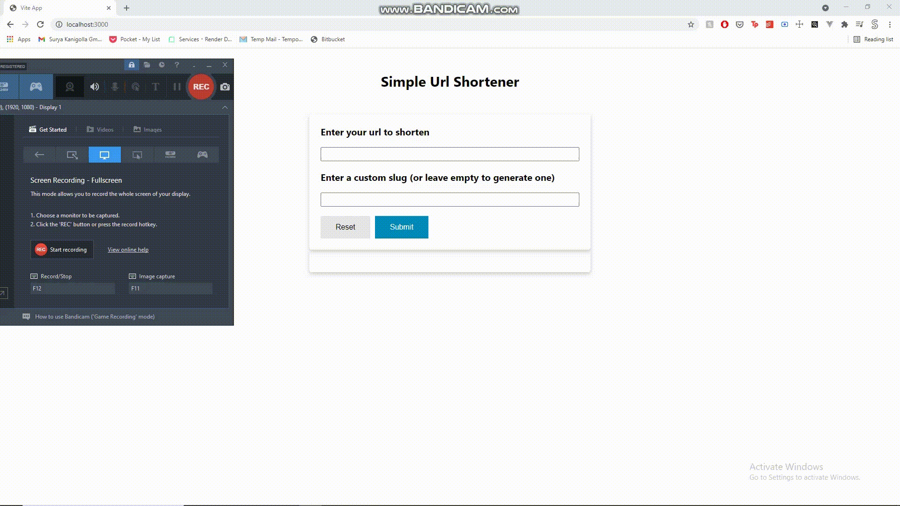

<!-- PROJECT LOGO -->

<br />

  <h3 align="center">Simple Url Shortener</h3>


  <p align="center">
     An url shortener made using Node JS, React JS, Express JS and with Hasura.
    <br />
    <a href="https://url-shortener-hasura.herokuapp.com/">View Website</a>
  </p>

<!-- TABLE OF CONTENTS -->
<details open="open">
  <summary>Table of Contents</summary>
  <ol>
        <li><a href="#built-with">Built With</a></li>
      </ul>
    </li>
    <li><a href="#installation">Installation</a></li></li>
      </ul>
    </li>
    <li><a href="#usage">Usage</a></li>
    <li><a href="#hasura">Hasura</a></li>
    <li><a href="#contact">Contact</a></li>
  </ol>
</details>

<!-- ABOUT THE PROJECT -->

## About The Project

### Built With

- [ReactJS](https://reactjs.org/)
- [Hasura](https://hasura.io/)
- [Express JS ](https://expressjs.com/)
- [Node JS](https://nodejs.org/en/)

### Installation

```sh
git clone https://github.com/suryakanigolla/url-shortener-node-hasura.git .
npm install
npm run build
npm run start
```

<!-- USAGE EXAMPLES -->

## Usage

<figure>
    
</figure>

- Shorten your links with a button click

## Hasura 

Created a table with id, slug, url as columns. Indexed based on the slug column. Kept the slug column unique to avoid url collision. Requested data from Node backend using the GraphQL Post url

<!-- CONTACT -->

## Contact

[![LinkedIn][linkedin-shield]][linkedin-url]

[linkedin-shield]: https://img.shields.io/badge/-LinkedIn-black.svg?style=for-the-badge&logo=linkedin&colorB=555
[linkedin-url]: https://www.linkedin.com/in/suryakanigolla/
